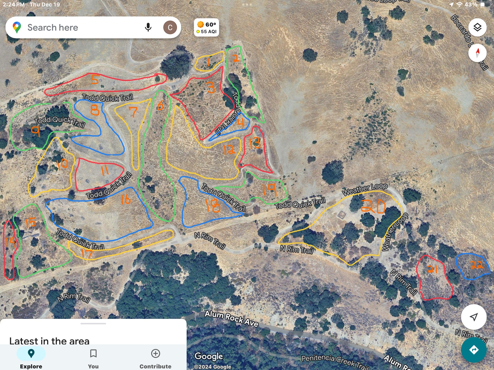
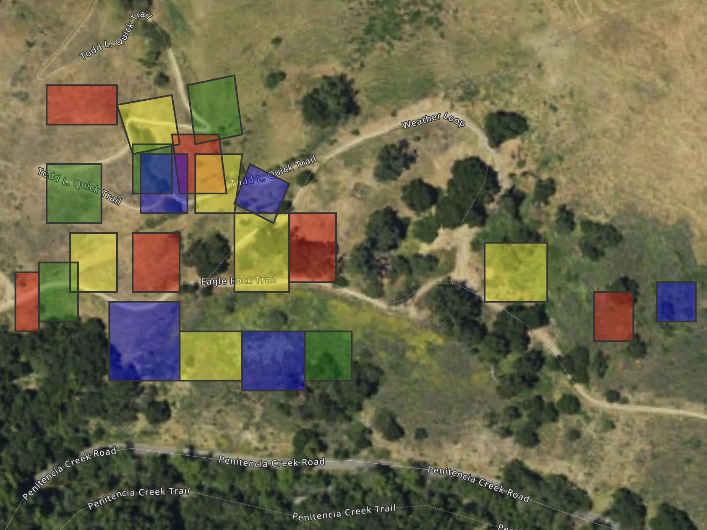
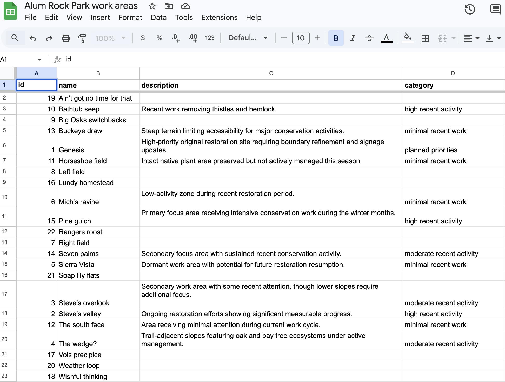
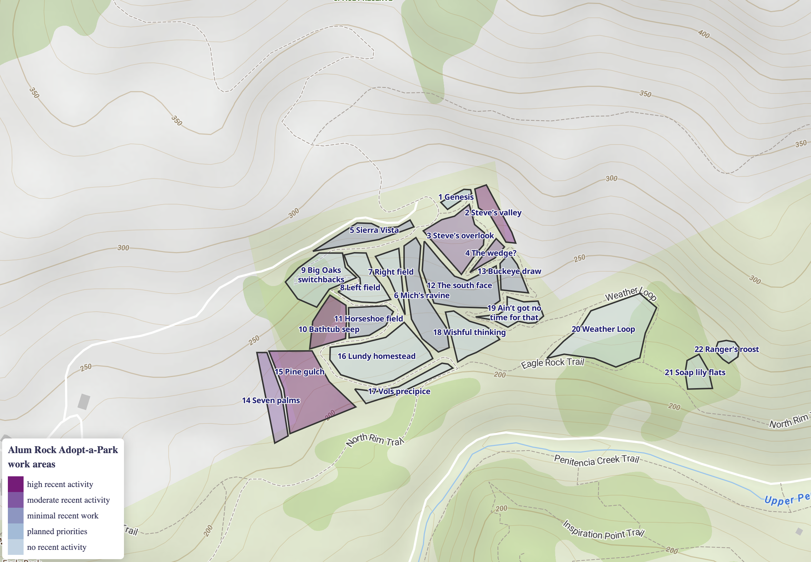

# Alum Rock Park

I recently joined a small group of dedicated volunteers working on habitat restoration
in [Alum Rock Park](https://www.sanjoseca.gov/Home/Components/FacilityDirectory/FacilityDirectory/2088/2028)
in San José, California. Over the last 8 years, the group has been removing invasive plants and planting natives,
helping to restore the natural habitat in California's oldest municipal park.

Over the last 8 or so years, the group has worked in and named 20 areas on the north side of Penitencia Creek.
Chuck Hinkle, a long term volunteer, created a [manually annotated map](orig/map.jpg) to help new volunteers get
oriented. Recently, people from the City of San José and the neighboring Open Space Authority asked for more
details on the group's work.

I created a first pass GeoJSON file by uploading a photo of the hand-drawn map to ChatGPT, along with approximate
coordinates of the center of the map and another photo of the map key. This quickly returned a GeoJSON file with
square polygons and labels in roughly correct relative positions:

I edited the features with the
[MapTiler UI](https://www.maptiler.com), then exported a more accurate GeoJSON file. I used MapTiler's excellent
example examples to create an
[interactive version](https://kielni.s3.us-west-2.amazonaws.com/arp/index.html) with a satellite basemap, 
and a [print version](https://kielni.s3.us-west-2.amazonaws.com/arp/index.html?print) with an outdoor basemap.
The online version displays context about each area in a popup, sourced from a Google Sheet. Members of the
group can use a familiar spreadsheet interface to add notes on projects, and these are immediately visible
in the map.

### screenshots

**[interactive map](https://kielni.s3.us-west-2.amazonaws.com/arp/index.html)**

**with notes sourced from a Google Sheet**

**[print map](https://kielni.s3.us-west-2.amazonaws.com/arp/index.html?print)**

